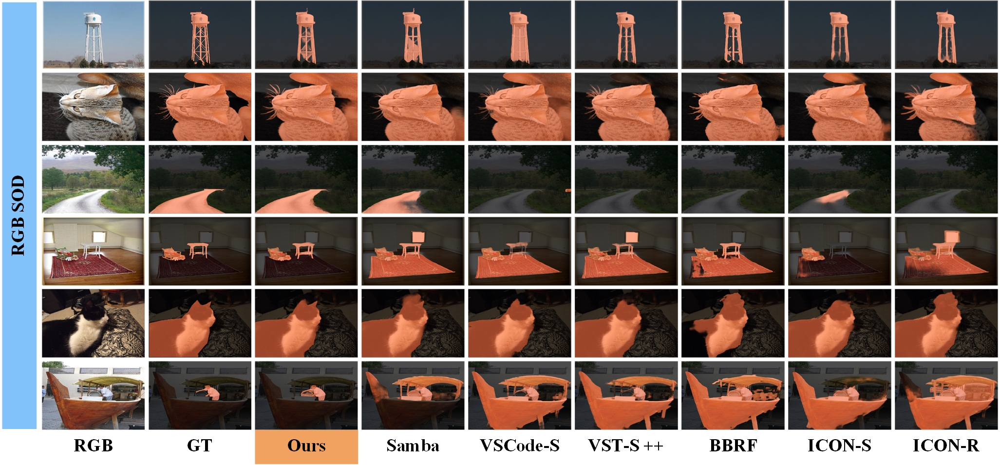
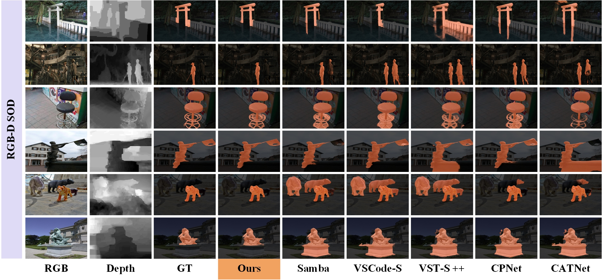
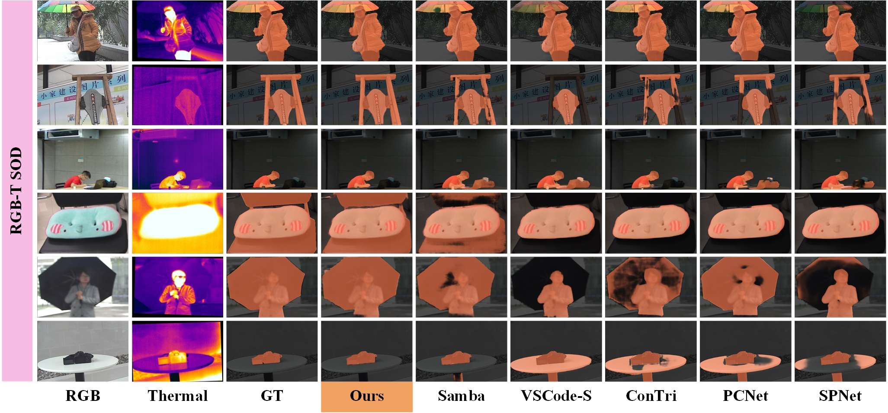
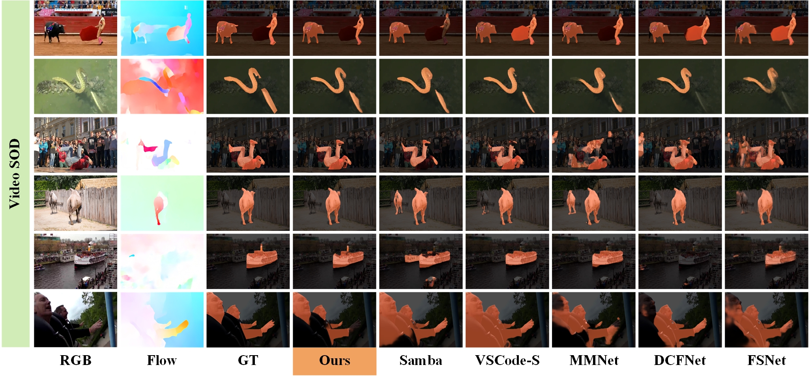
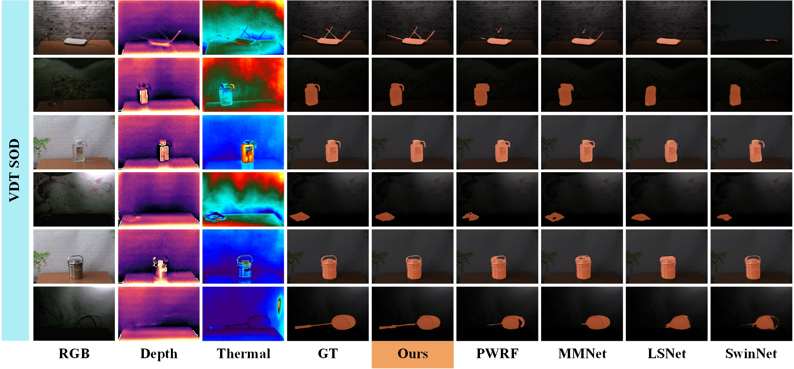

<h1>LFNet: Liquid Fusion of Heterogeneous Representations Towards General Salient Object Detection</h1>

---

## 📢 News
- **[2026.6.25]** Training weights and prediction maps are now available on Baidu Netdisk.
- **[2026.6.25]** Code and paper will be released soon. Stay tuned!

---

## 📖 Introduction
The proposed **LFNet** is designed for **General Salient Object Detection**, covering five main downstream tasks:
- 🟢 **RGB SOD**
- 🔵 **RGB-D SOD**
- 🟠 **RGB-T SOD**
- 🟣 **Video SOD**
- 🟤 **VDT SOD**

The implementation smartly integrates **VMamba** and **ConvNeXt** features through a novel **Liquid Fusion** mechanism, and employs saliency-guided upsampling to achieve high-quality and robust saliency prediction across various heterogeneous scenarios.

---

## ⚙️ Framework

  

  <em>Figure 1: Overall architecture of the proposed LFNet.</em>

---

## 👁️ Visual Examples

We provide qualitative comparisons of LFNet across all five SOD tasks. 

<b>1. RGB SOD Results</b> (Click to expand)

  

<b>2. RGB-D SOD Results</b> (Click to expand)

  

<b>3. RGB-T SOD Results</b> (Click to expand)

  

<b>4. Video SOD Results</b> (Click to expand)

  

<b>5. VDT SOD Results</b> (Click to expand)

  

---

## 📥 Model Weights & Prediction Results

The trained checkpoints and prediction maps across all evaluated datasets are provided via Baidu Netdisk.

| 📦 Resource | 📝 Description | 🔗 Link | 🔑 Extraction Code |
| :--- | :--- | :---: | :---: |
| `ckpt` | Trained model checkpoints | [Baidu Disk](https://pan.baidu.com/s/1MESFH7-tUafPc8nJiLU8Hw) | `lsod` |
| `results.zip` | Prediction maps / saliency results | [Baidu Disk](https://pan.baidu.com/s/1u495WwMQmWk6e_g4PKr7Hw) | `lsod` |

---

## 🛠️ Environment / Configuration

For environment setup and configuration, please refer to **Samba**: [https://github.com/Jia-hao999/Samba](https://github.com/Jia-hao999/Samba).

---